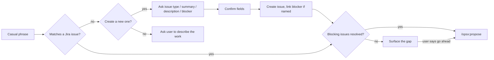

# 🔖 backlog-match


A Claude Code skill that matches a plain-language description of backlog
work to a Jira issue, checks that its blockers are resolved, and hands off
to OpenSpec's proposal flow — no need to recall the exact issue key.

If nothing matches, it doesn't just give up — it offers to create the
issue instead, asks for what it needs (issue type, summary, description,
whether it's blocked by anything else in the backlog), and shows you the
exact fields before writing anything to Jira.

## 🤔 Why

Backlogs pile up fast, and remembering the exact issue key shouldn't be
the thing standing between an idea and a formal proposal. Describe the
work the way you'd actually say it out loud, and this skill finds it in
your Jira backlog, checks for unresolved dependencies, and kicks off the
OpenSpec flow.

## 🧭 How it works



## Prerequisites

<details>
<summary><strong>1. OpenSpec initialized, with its <code>opsx</code> commands present</strong></summary>
<br>

This plugin does **not** bundle or initialize OpenSpec itself — the
consuming project must already have run OpenSpec's own init/setup step,
which scaffolds `.claude/commands/opsx/`. At minimum `/opsx:propose` must
exist there, and ideally the full workflow (`/opsx:new`, `/opsx:apply`,
`/opsx:verify`, `/opsx:archive`, etc.) for the backlog-to-implementation
loop to work end-to-end. See `.claude/commands/opsx/` in the
`openspec-workout` project for a reference implementation of what needs to
be present.

</details>

<details>
<summary><strong>2. A Jira/Atlassian MCP server connected</strong></summary>
<br>

Any MCP server that exposes a JQL search or issue-lookup tool works. The
skill discovers the right one by name at runtime instead of hardcoding a
specific integration, so it isn't tied to any particular Jira MCP server.
Day to day it mostly reads issues — search and fetch — and it can create a
new one (optionally linked to an existing issue as a blocker) once you've
confirmed the details, but it never edits, transitions, or comments on an
issue that already exists.

</details>

<br>

Without prerequisite 2, there's no Jira to search — the skill has nowhere
to look and no fallback, so it says as much and stops. Without prerequisite
1, it can still find (or create) the matching issue, but the final
`/opsx:propose` handoff has nothing to run against.

## 🔄 v1 vs v2

v1 matched against a local `BACKLOG.md` table. v2 replaces that with live
Jira issues and adds the ability to create one on the spot:

| | v1 | v2 |
|---|---|---|
| Data source | Local `BACKLOG.md` file | Live Jira, via any Jira/Atlassian MCP tool available |
| Matching against | `Change` name / `What it does` column | Issue summary / description |
| Dependency check | `Depends on` column vs. other rows' `Status` | Issue links (`blocks` / `is blocked by`) vs. the blocker's status |
| No match found | Ask the user to describe the work | Offer to create the issue — asking issue type, summary, description, and an optional blocker — after confirming the fields |
| Prerequisite missing | Offer to scaffold `BACKLOG.md` from a template | Say so and stop; there's no fallback |
| Handoff format | `/opsx:propose "<change-slug>: <what it does>"` | `/opsx:propose "<ISSUE-KEY>: <summary>"` |

v1 is still available in this repo's git history if you need to reference
it; the plugin itself only ships v2 going forward.

## 🗺️ Roadmap: v3 (planned) — syncing back to Jira

v1 and v2 only flow one way: Jira → OpenSpec. v3 will close the loop —
as an OpenSpec change moves through its lifecycle, push that state back
to the Jira issue it came from, via a companion skill (`backlog-sync`).
Not built yet; this is the intended design:

| | Detail |
|---|---|
| Trigger | Conversational, like `backlog-match` itself — you say something like "this shipped, sync it back to Jira" once a change is archived. It is **not** triggered by `/opsx:archive` completing: skills don't get invoked by another command finishing, and there's no Claude Code hook for "a slash command completed" to hang this on either. |
| Action | Transition the source Jira issue's status (e.g. → Done) and post a comment linking the PR/commit. |
| Scope | Only the issue `backlog-match` originally matched or created for that change — it won't go looking for other issues to update. |
| Trade-off | Not automatic — it depends on someone actually invoking it after archiving. The alternative (wiring a sync step into `/opsx:archive`'s own prompt) would need edits to that peer dependency's command file, which this plugin doesn't own or bundle. |

## Install

Via marketplace (recommended):

```
/plugin marketplace add uanandu/backlog-match
/plugin install backlog-match@uanandu-backlog-match
```

Or manually: copy this repo into the consuming project's
`.claude/plugins/backlog-match/` directory.

## 💡 Example

Given this issue in Jira:

| Key      | Summary                                           | Status  | Links |
| -------- | -------------------------------------------------- | ------- | ----- |
| PROJ-142 | Weekly meal planning and grocery list generation  | Backlog | —     |

Saying **"let's do the meal tracking one"** is enough. The skill matches it
against the issue's summary and description, checks for unresolved
blockers, and — once you confirm — hands off to:

```
/opsx:propose "PROJ-142: Weekly meal planning and grocery list generation"
```
