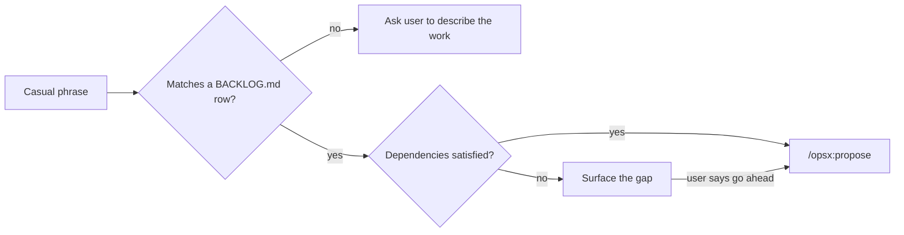

# 🔖 backlog-match

> "let's do the meal tracking one" → matched, checked, and handed to OpenSpec.


A Claude Code skill that turns a casual, half-remembered mention of backlog
work into a formal OpenSpec proposal — no need to recall the exact
`BACKLOG.md` row name.

## 🤔 Why

Backlog rows pile up fast, and remembering the exact `Change` slug
(`meal-planner`, not "the meal tracking one") shouldn't be the thing
standing between an idea and a formal proposal. This skill closes that
gap: describe the work the way you'd actually say it out loud, and it
resolves the row, checks dependencies, and kicks off the OpenSpec flow.

## 💡 Example

Given this row in `BACKLOG.md`:

| Change | What it does | Priority | Depends on | Status | Notes |
|---|---|---|---|---|---|
| meal-planner | Weekly meal planning and grocery list generation | P1 | | Backlog | |

Saying **"let's do the meal tracking one"** is enough. The skill matches
it against `Change` and `What it does`, checks `Depends on` against the
other rows' `Status`, and — once confirmed — hands off to:

```
/opsx:propose "meal-planner: Weekly meal planning and grocery list generation"
```

## 🧭 How it works



## Prerequisites

<details>
<summary><strong>1. OpenSpec initialized, with its <code>opsx</code> commands present</strong></summary>
<br>

This plugin does **not** bundle or initialize OpenSpec itself — the
consuming project must already have run OpenSpec's own init/setup step,
which scaffolds `.claude/commands/opsx/`. At minimum `/opsx:propose` must
exist there, and ideally the full workflow (`/opsx:new`, `/opsx:apply`,
`/opsx:verify`, `/opsx:archive`, etc.) for the backlog-to-implementation
loop to work end-to-end. See `.claude/commands/opsx/` in the
`openspec-workout` project for a reference implementation of what needs to
be present.

</details>

<details>
<summary><strong>2. A <code>BACKLOG.md</code> at the project root</strong></summary>
<br>

Using a row-based table format with at least these columns: `Change`,
`What it does`, `Priority`, `Depends on`, `Status`, `Notes`. This skill
reads that file directly — it does not parse any other format.

</details>

<br>

Without both, the skill can still match a phrase to a row, but the final
`/opsx:propose` handoff (or the dependency-gap check against `Status`) will
have nothing to run against.

## Install

Via marketplace (recommended):

```
/plugin marketplace add uanandu/backlog-match
/plugin install backlog-match@uanandu-backlog-match
```

Or manually: copy this repo into the consuming project's
`.claude/plugins/backlog-match/` directory.
