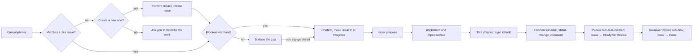

# 🔖 backlog-match


A Claude Code plugin that connects your Jira backlog to
[OpenSpec](https://github.com/Fission-AI/OpenSpec). Describe work the way you'd
say it out loud, and Claude finds the Jira issue, checks its blockers, and
starts the proposal. When the work ships, it sends the issue for review and
leaves a trail in Jira.

No need to remember an issue key. No copy-pasting between tools.

## What's in the plugin

| Skill | Direction | What it does |
|---|---|---|
| `backlog-match` | Jira → OpenSpec | Finds the issue for a piece of work (or creates it), checks that its blockers are resolved, and hands off to `/opsx:propose`. |
| `backlog-sync` | OpenSpec → Jira | Once a change ships, creates a review sub-task, moves the issue to Ready for Review and comments with the PR/commit link. Can mark it Done directly if you ask. |

Both are triggered by plain conversation, not slash commands.

## 🧭 How it works



Solid arrows are the skills. Dotted arrows are your own work: the OpenSpec
steps in the middle, and the review at the end.

## ✨ Features

**`backlog-match`**
- Matches informal phrasing to issue summaries and descriptions — "meal
  tracking" finds "Weekly meal planning and grocery list generation".
  Sub-tasks are skipped, so you land on the story, not on its review task.
- Asks which candidate you mean when more than one matches.
- Checks `blocks` / `is blocked by` links and tells you about unresolved
  blockers before you start. A blocker only counts as resolved once it's in
  a Done status, so one still waiting for review stays a blocker.
- If nothing matches, offers to create the issue: you choose the type,
  review the summary and description, and optionally name a blocker. Nothing
  is written until you confirm the exact fields.
- When you confirm the proposal, moves the issue to **In Progress** (skipped if
  it's already In Progress or further along, or if you say to leave the
  ticket alone).
- Beyond that one move, never edits, comments on, or transitions an existing
  issue. Review, Done and comments are `backlog-sync`'s job.

**`backlog-sync`**
- Finds the Jira issue a change came from and checks it matches before
  writing anything.
- **Review mode (default):** creates a `Review: …` sub-task (with what
  shipped, the PR link, the specs touched and task progress), moves the
  issue to a *Ready for Review* status, and comments on it. It never marks
  the issue Done, because it can't know whether the review passed.
- **Done mode:** say "mark it done" and it moves the issue straight to Done
  instead, with no sub-task.
- Picks the workflow transition by the status it leads to, and asks you when
  it's ambiguous. Workflows differ per project, so it doesn't assume.
- Won't create a second review sub-task if an open one already exists.
- Shows the exact sub-task, status change and comment and waits for your yes.
- Updates only that one issue, plus the one review sub-task under it.

## Prerequisites

<details>
<summary><strong>1. OpenSpec set up in your project</strong></summary>
<br>

This plugin doesn't bundle OpenSpec. Your project needs OpenSpec's own
setup, which scaffolds the `opsx` commands in `.claude/commands/opsx/`. At
minimum `/opsx:propose` must exist; for the full flow you'll also want
`/opsx:apply` and `/opsx:archive`. See the
[OpenSpec repo](https://github.com/Fission-AI/OpenSpec) for setup.

</details>

<details>
<summary><strong>2. A Jira / Atlassian MCP server connected to Claude Code</strong></summary>
<br>

Any MCP server that can search and read Jira issues works. The skills find
the right tools by capability at runtime, so they aren't tied to one
server.

- `backlog-match` needs search and fetch, list transitions and transition
  (to move the issue to In Progress), plus create-issue and issue-link if you
  want it to create issues.
- `backlog-sync` needs fetch, search, list transitions, transition, add
  comment, and create issue (for the review sub-task).

If no Jira tool is available, the skills say so and stop. There is no
fallback to a local file.

</details>

<details>
<summary><strong>3. A review-ready status in your Jira workflow (for review mode)</strong></summary>
<br>

Review mode looks for a status like **Ready for Review** or **Awaiting
Review**. A workflow such as To Do → In Progress → Ready for Review → In
Review → Done works well. Keep the review statuses in Jira's *In Progress*
category, not *Done*, so the blocker check treats work waiting for review as
unfinished. If your workflow has no such status, `backlog-sync` says so and
offers Done mode or a sub-task without a status change.

To have the parent close itself once the review sub-task is Done, add a Jira
automation rule: "when all sub-tasks are Done, move the parent to Done".

</details>

<details>
<summary><strong>4. (Optional) A git repository with a remote</strong></summary>
<br>

`backlog-sync` reads your git history, read-only, to find the merged PR or
commit to link in its Jira comment (no GitHub CLI needed). If it can't find
one, it asks you for a link.

</details>

## Install

Via marketplace (recommended):

```
/plugin marketplace add uanandu/backlog-match
/plugin install backlog-match@uanandu-backlog-match
```

Or manually: copy this repo into your project's
`.claude/plugins/backlog-match/` directory.

## 💡 Example

Given this issue in Jira:

| Key      | Summary                                          | Status  | Links |
| -------- | ------------------------------------------------ | ------- | ----- |
| PROJ-142 | Weekly meal planning and grocery list generation | Backlog | —     |

**You:** "let's do the meal tracking one"

**Claude:** searches the backlog, matches `PROJ-142`, finds no open
blockers, and asks: "Found PROJ-142: Weekly meal planning and grocery list
generation. No open blockers. Start the proposal and move it to In
Progress?"

**You:** "yep"

**Claude** moves `PROJ-142` to In Progress, then hands off by running:

```
/opsx:propose "PROJ-142: Weekly meal planning and grocery list generation (Jira: PROJ-142 — keep the key in the change name and reference it in proposal.md)"
```

The trailing note keeps the issue key in the OpenSpec change so
`backlog-sync` can find it later. If `PROJ-142` had an unresolved blocker,
Claude would tell you first and wait for you to say go ahead.

### When it ships

After implementing and running `/opsx:archive`:

**You:** "the meal planner change shipped, sync it back to Jira"

**Claude** finds the archived change, recovers `PROJ-142`, looks up the merged
PR, and shows you what it's about to do:

> **PROJ-142** — Weekly meal planning and grocery list generation
> New sub-task: "Review: Weekly meal planning and grocery list generation"
> (PR link, specs touched: `meal-planning`, 5/5 tasks done)
> Status: In Progress → Ready for Review
> Comment: "OpenSpec change `add-meal-planner` archived 2026-09-25. Adds
> weekly meal planning and grocery list generation. Review sub-task:
> PROJ-143. PR: https://github.com/…/pull/17"

**You:** "yes"

**Claude** creates the review sub-task, moves the issue to Ready for Review,
posts the comment, and reports what it did. When the reviewer closes the
sub-task, the issue can move to Done. Say "mark it done" instead and it skips
the sub-task and moves the issue straight to Done.

## Good to know

- **Sync is manual.** Claude Code has no hook for "a slash command finished",
  so `backlog-sync` runs when you ask for it, not automatically after
  `/opsx:archive`.
- **The handoff is conversational.** Skills can't run another slash command
  directly, so `backlog-match` outputs the `/opsx:propose` command as its
  next turn. If it doesn't fire, run it yourself.
- **Proposing a change without `backlog-match`?** Put the Jira key in the
  change name or in `proposal.md`, or `backlog-sync` will ask you for it.

## License

[MIT](LICENSE)
