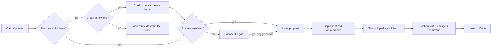

# 🔖 backlog-match


A Claude Code plugin that connects your Jira backlog to
[OpenSpec](https://github.com/Fission-AI/OpenSpec). Describe work the way you'd
say it out loud, and Claude finds the Jira issue, checks its blockers, and
starts the proposal. When the work ships, it updates the issue for you.

No need to remember an issue key. No copy-pasting between tools.

## What's in the plugin

| Skill | Direction | What it does |
|---|---|---|
| `backlog-match` | Jira → OpenSpec | Finds the issue for a piece of work (or creates it), checks that its blockers are resolved, and hands off to `/opsx:propose`. |
| `backlog-sync` | OpenSpec → Jira | Once a change ships, moves the issue to Done and comments with the PR/commit link. |

Both are triggered by plain conversation, not slash commands.

## 🧭 How it works



Solid arrows are `backlog-match`. The dotted path is your normal OpenSpec
work, ending with `backlog-sync`.

## ✨ Features

**`backlog-match`**
- Matches informal phrasing to issue summaries and descriptions — "meal
  tracking" finds "Weekly meal planning and grocery list generation".
- Asks which candidate you mean when more than one matches.
- Checks `blocks` / `is blocked by` links and tells you about unresolved
  blockers before you start.
- If nothing matches, offers to create the issue: you choose the type,
  review the summary and description, and optionally name a blocker. Nothing
  is written until you confirm the exact fields.
- Never edits, transitions, or comments on an issue that already exists.

**`backlog-sync`**
- Finds the Jira issue a change came from and checks it matches before
  writing anything.
- Picks the workflow transition that leads to a Done status, or asks you when
  it's ambiguous. Workflows differ per project, so it doesn't assume.
- Posts a comment with the change name, what shipped, and a link to the
  merged PR or commit.
- Shows the exact status change and comment and waits for your yes.
- Updates only that one issue.

## Prerequisites

<details>
<summary><strong>1. OpenSpec set up in your project</strong></summary>
<br>

This plugin doesn't bundle OpenSpec. Your project needs OpenSpec's own
setup, which scaffolds the `opsx` commands in `.claude/commands/opsx/`. At
minimum `/opsx:propose` must exist; for the full flow you'll also want
`/opsx:apply` and `/opsx:archive`. See the
[OpenSpec repo](https://github.com/Fission-AI/OpenSpec) for setup.

</details>

<details>
<summary><strong>2. A Jira / Atlassian MCP server connected to Claude Code</strong></summary>
<br>

Any MCP server that can search and read Jira issues works. The skills find
the right tools by capability at runtime, so they aren't tied to one
server.

- `backlog-match` needs search and fetch, plus create-issue and issue-link
  if you want it to create issues.
- `backlog-sync` needs fetch, list transitions, transition, and add comment.

If no Jira tool is available, the skills say so and stop. There is no
fallback to a local file.

</details>

<details>
<summary><strong>3. (Optional) <code>git</code> and <code>gh</code></strong></summary>
<br>

`backlog-sync` uses them, read-only, to find the merged PR or commit to
link in its Jira comment. Without them it asks you for a link.

</details>

## Install

Via marketplace (recommended):

```
/plugin marketplace add uanandu/backlog-match
/plugin install backlog-match@uanandu-backlog-match
```

Or manually: copy this repo into your project's
`.claude/plugins/backlog-match/` directory.

## 💡 Example

Given this issue in Jira:

| Key      | Summary                                          | Status  | Links |
| -------- | ------------------------------------------------ | ------- | ----- |
| PROJ-142 | Weekly meal planning and grocery list generation | Backlog | —     |

**You:** "let's do the meal tracking one"

**Claude:** searches the backlog, matches `PROJ-142`, finds no open
blockers, and asks: "Found PROJ-142: Weekly meal planning and grocery list
generation. No open blockers. Start the proposal?"

**You:** "yep"

**Claude** hands off by running:

```
/opsx:propose "PROJ-142: Weekly meal planning and grocery list generation (Jira: PROJ-142 — keep the key in the change name and reference it in proposal.md)"
```

The trailing note keeps the issue key in the OpenSpec change so
`backlog-sync` can find it later. If `PROJ-142` had an unresolved blocker,
Claude would tell you first and wait for you to say go ahead.

### When it ships

After implementing and running `/opsx:archive`:

**You:** "the meal planner change shipped, sync it back to Jira"

**Claude** finds the archived change, recovers `PROJ-142`, looks up the merged
PR, and shows you what it's about to do:

> **PROJ-142** — Weekly meal planning and grocery list generation
> Status: Backlog → Done
> Comment: "OpenSpec change `add-meal-planner` archived 2026-09-25. Adds
> weekly meal planning and grocery list generation.
> PR: https://github.com/…/pull/17"

**You:** "yes"

**Claude** moves the issue to Done, posts the comment, and reports the new
status.

## Good to know

- **Sync is manual.** Claude Code has no hook for "a slash command finished",
  so `backlog-sync` runs when you ask for it, not automatically after
  `/opsx:archive`.
- **The handoff is conversational.** Skills can't run another slash command
  directly, so `backlog-match` outputs the `/opsx:propose` command as its
  next turn. If it doesn't fire, run it yourself.
- **Proposing a change without `backlog-match`?** Put the Jira key in the
  change name or in `proposal.md`, or `backlog-sync` will ask you for it.

## License

[MIT](LICENSE)
